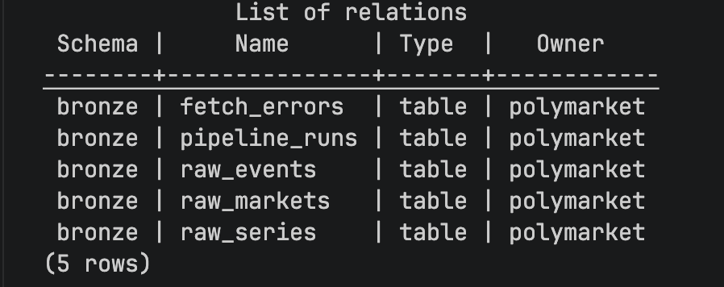
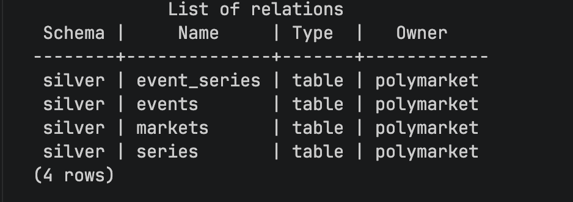
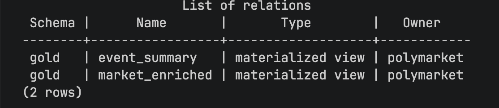
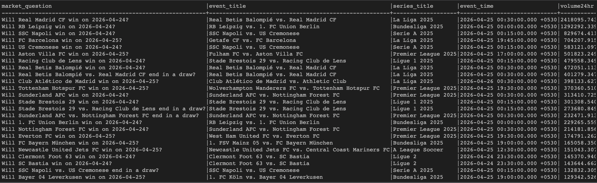

# Polymarket Football Warehouse

A local Postgres data warehouse and Python ETL pipeline for Polymarket football prediction markets. Ingests 500 football events from the Polymarket Gamma API and builds a medallion architecture (Bronze → Silver → Gold) for analysis and business intelligence.

---

## Architecture

```
Polymarket Gamma API
        │
        ▼
┌───────────────────────────────────────────────────────┐
│  Bronze Layer  (raw ingestion)                        │
│  ─────────────────────────────────────────────────    │
│  bronze.pipeline_runs   — run tracking + recovery     │
│  bronze.raw_events      — full API payloads (JSONB)   │
│  bronze.raw_markets     — merged market records       │
│  bronze.raw_series      — deduplicated series         │
│  bronze.fetch_errors    — dead-letter for failures    │
└───────────────────────────────────────────────────────┘
        │
        ▼
┌───────────────────────────────────────────────────────┐
│  Silver Layer  (cleaned, typed, relational)           │
│  ─────────────────────────────────────────────────    │
│  silver.series          — league / competition info   │
│  silver.events          — one row per football match  │
│  silver.event_series    — N:N junction (event↔series) │
│  silver.markets         — one row per market          │
└───────────────────────────────────────────────────────┘
        │
        ▼
┌───────────────────────────────────────────────────────┐
│  Gold Layer  (business-facing marts)                  │
│  ─────────────────────────────────────────────────    │
│  gold.market_enriched   — one row per market with     │
│                           event + series context      │
│  gold.event_summary     — one row per event with      │
│                           aggregated market metrics   │
└───────────────────────────────────────────────────────┘
```

### Schema Diagram

```
bronze layer (raw ingestion)
┌─────────────────┐   ┌──────────────────┐   ┌──────────────────┐   ┌──────────────────┐
│ pipeline_runs   │   │ raw_events       │   │ raw_markets      │   │ raw_series       │
│─────────────────│   │──────────────────│   │───────────────── │   │──────────────────│
│ run_id (PK)     │   │ run_id           │   │ run_id           │   │ run_id           │
│ status          │   │ event_id  ─UNIQ─ │   │ market_id ─UNIQ─ │   │ series_id ─UNIQ─ │
│ started_at      │   │ raw_payload JSONB│   │ event_id         │   │ raw_payload JSONB│
│ completed_at    │   │ ingested_at      │   │ raw_payload JSONB│   │ ingested_at      │
│ events_fetched  │   └──────────────────┘   │ ingested_at      │   └──────────────────┘
│ markets_fetched │                          └──────────────────┘
└─────────────────┘   ┌──────────────────┐
                      │ fetch_errors     │
                      │──────────────────│
                      │ run_id           │
                      │ entity_type ─────│── 'event' | 'market'
                      │ entity_id  ─UNIQ─│
                      │ error_type       │
                      └──────────────────┘

silver layer (typed, relational)
┌──────────────┐       ┌───────────────────┐       ┌────────────────┐
│ series       │       │ event_series      │       │ events         │
│──────────────│       │───────────────────│       │──────────────  │
│ series_id PK │◄──────│ series_id FK      │       │ event_id PK    │
│ title        │       │ event_id  FK ─────│──────►│ title          │
│ active       │       │ is_primary        │       │ game_start_time│
│ volume24hr   │       └───────────────────┘       │ active/closed  │
└──────────────┘                                   │ neg_risk       │
                                                   └──────┬─────────┘
                                                          │
                                                   ┌──────▼────────┐
                                                   │ markets       │
                                                   │───────────────│
                                                   │ condition_id  │← PK (hex)
                                                   │ event_id FK   │
                                                   │ question      │
                                                   │ volume24hr    │
                                                   │ liquidity     │
                                                   │ outcomes JSONB│
                                                   └───────────────┘

gold layer (materialized views — refreshed each run)
┌──────────────────────────────┐   ┌──────────────────────────────┐
│ market_enriched              │   │ event_summary                │
│──────────────────────────────│   │──────────────────────────────│
│ condition_id (unique index)  │   │ event_id (unique index)      │
│ market_question              │   │ event_title                  │
│ event_title                  │   │ series_title                 │
│ series_title                 │   │ market_count                 │
│ event_time                   │   │ active_market_count          │
│ volume24hr / liquidity       │   │ total_volume24hr             │
│ active / accepting_orders    │   │ max_volume24hr               │
└──────────────────────────────┘   │ concentration (computable)   │
                                   └──────────────────────────────┘
```

### Design Decisions

| Decision | Rationale |
|---|---|
| Logged bronze tables | Raw payloads survive crashes and remain queryable across runs for historical auditing and re-deriving silver without hitting the API. |
| Server-side silver transform | Bronze → silver uses `INSERT INTO silver.x SELECT ... FROM bronze.raw_x` — the transform runs entirely inside Postgres. No data leaves the database after bronze loading. Type coercions (`::timestamptz`, `::numeric`, `::jsonb`) happen in SQL. |
| `asyncio` + `aiohttp` | ~20x speedup over sequential fetching for 500+ API calls. Semaphore(20) caps concurrency to avoid rate limits. |
| `asyncpg` over psycopg2 | Native async Postgres driver using binary protocol — 3–5x faster bulk writes. |
| Two-pass market fetch | `/events` gives base market data but no `volume24hr`. Pass 2 fetches `/markets` for that field and merges results. |
| `silver.event_series` junction | Events can belong to multiple series. `is_primary=TRUE` on `series[0]` prevents row duplication in gold joins. |
| Materialized views for gold | Regular views recompute on every query. Materialized views store results on disk — gold queries are instant. `REFRESH CONCURRENTLY` keeps old data readable during refresh. |
| SQL `::timestamptz` for silver timestamps | Gamma API returns timestamps in 4+ formats. PostgreSQL's `::timestamptz` cast handles all of them natively inside the silver `INSERT...SELECT` — no Python parsing needed. Pendulum is still used in the bronze loader for the run's `ingested_at` timestamp. |
| `pipeline_runs` table | Tracks run status. If a run crashes (`status='running'`), the next invocation resumes it — bronze skips already-loaded rows via `ON CONFLICT DO NOTHING`. |

---

## Project Structure

```
dgpredict_project/
├── Dockerfile                  # Python 3.11-slim + uv
├── docker-compose.yml          # postgres + etl services
├── Makefile                    # named commands for all operations
├── pyproject.toml              # dependencies
├── .env.example                # template for credentials
├── main.py                     # pipeline orchestrator
│
├── data/
│   └── football_event_ids_500.csv   # 500 event IDs (provided)
│
├── sql/
│   ├── bronze/schema.sql       # bronze DDL
│   ├── silver/schema.sql       # silver DDL
│   └── gold/schema.sql         # gold materialized views
│
└── src/
    ├── config.py               # env var config
    ├── db.py                   # asyncpg connection pool
    ├── logger.py               # centralised logging
    ├── ingestion/
    │   └── fetcher.py          # async Gamma API fetcher
    ├── bronze/
    │   └── loader.py           # raw payload ingestion
    ├── silver/
    │   └── transform.py        # typed upserts from bronze
    └── gold/
        └── mart.py             # materialized view refresh
```

---

## Setup & Run Instructions

### Prerequisites

- [Docker Desktop](https://www.docker.com/products/docker-desktop/) installed and running

---

### Option A — Using `make` (macOS / Linux)

`make` is pre-installed on macOS and most Linux distros. Easiest option.

```bash
# 1. Copy environment template (defaults work out of the box)
cp .env.example .env

# 2. First-time: build image + run full pipeline
make build

# Re-run the pipeline manually
make run

# Rebuild ETL image after code changes, then run
make rebuild

# Start Postgres in background only (for local dev)
make postgres

# Open a psql shell to inspect data
make psql

# Wipe everything and start fresh
make reset
```

---

### Option B — Raw Docker commands (Windows / no `make`)

Use these if `make` is not available on your machine.

```bash
# 1. Copy environment template
cp .env.example .env          # macOS / Linux
copy .env.example .env        # Windows Command Prompt

# 2. First-time: build image + run full pipeline
docker compose up --build

# Re-run the pipeline (Postgres already running)
docker compose run --rm etl

# Rebuild ETL image after code changes, then run
docker compose build etl
docker compose run --rm etl

# Start Postgres in background only
docker compose up -d postgres

# Open a psql shell to inspect data
docker compose exec postgres psql -U polymarket -d polymarket

# Stop containers but keep data
docker compose down

# Wipe everything (containers + data volume)
docker compose down -v
```

---

### Option C — Run locally without Docker

Useful for debugging or if you have Postgres installed locally.

```bash
# 1. Start Postgres via Docker (or use a local install)
docker compose up -d postgres

# 2. Set up environment
cp .env.example .env
# Edit .env: set POSTGRES_HOST=localhost

# 3. Install dependencies and run
uv pip install -e .
uv run python main.py
```

---

### Inspect the database (after pipeline runs)

```bash
# Inside psql shell:
SELECT count(*) FROM gold.market_enriched;
SELECT count(*) FROM gold.event_summary;

# Quick row count across all layers
SELECT 'bronze.raw_events'    AS tbl, count(*) FROM bronze.raw_events
UNION ALL
SELECT 'bronze.raw_markets',           count(*) FROM bronze.raw_markets
UNION ALL
SELECT 'silver.events',                count(*) FROM silver.events
UNION ALL
SELECT 'silver.markets',               count(*) FROM silver.markets
UNION ALL
SELECT 'gold.market_enriched',         count(*) FROM gold.market_enriched
UNION ALL
SELECT 'gold.event_summary',           count(*) FROM gold.event_summary;
```

---

## Assumptions & Tradeoffs

### API

- **Two-pass fetch**: The `/events` endpoint returns nested markets but without `volume24hr`. A second pass fetches `/markets?id=...` per market to get that field. This doubles API calls for markets but is the only way to get per-market 24hr volume.
- **Chunk size = 50**: The Gamma API silently truncates responses on very long query strings. Chunks of 50 IDs stay safely under the limit.
- **Semaphore = 20**: Above ~20 concurrent requests the API returns 429s. Below 10 it's too slow for 500+ events.
- **Series from event response**: Series data is embedded in the `/events` response (`event.series[]`). No separate `/series` endpoint calls are made.

### Data

- **`volume` and `liquidity` as strings**: The Gamma API returns these as strings in nested event markets (`"1057.07"`). We use `volumeNum` / `liquidityNum` (float fields) instead to avoid cast errors.
- **`outcomes` / `outcomePrices`**: Returned as JSON strings (`"[\"Yes\", \"No\"]"`) in some markets and native arrays in others. The silver transform normalises both by extracting as text (`->>`) and re-casting with `::jsonb` entirely inside Postgres.
- **`gameStartTime` as event_time**: More meaningful than `startDate` (market creation) or `endDate` (resolution deadline). Used as `event_time` in the gold layer.
- **`total_volume24hr` in `event_summary`**: Computed as `SUM(market.volume24hr)` across all markets for an event. For `negRisk` football events, one trade touches all sibling markets simultaneously, so this may slightly overcount vs true event-level 24hr volume. It remains internally consistent for ranking and concentration ratios.
- **`is_primary` in `event_series`**: `series[0]` from the API response is marked as primary. Gold joins on `is_primary = TRUE` to get exactly one series title per event, preventing row duplication.

### Pipeline

- **`run_id` = UTC timestamp**: Every pipeline run gets a fresh timestamp-based ID. This ensures markets are always re-fetched with current volumes and statuses. Crash recovery reuses the last `status='running'` run_id.
- **Bronze is logged**: Raw tables are WAL-backed so payloads survive crashes and remain available for historical querying and silver re-derivation.

### Architectural Trade-offs

#### Bronze `ON CONFLICT DO NOTHING` on crash recovery

When the pipeline crashes and restarts, it reuses the same `run_id`. Bronze inserts use `ON CONFLICT (run_id, entity_id) DO NOTHING` — already-written rows are skipped (checkpoint behaviour).

**Trade-off:** If the API returned fresh data for an already-written event (e.g. price moved between the crash and the retry), that fresh data is silently discarded — the old stale row is kept. This is acceptable because:
- The stale data only affects that one crashed `run_id`'s bronze rows
- Silver upserts (`ON CONFLICT DO UPDATE`) always reflect the latest bronze state
- The next successful clean run creates a fresh `run_id` and overwrites silver/gold with fully fresh data

If stale bronze data is unacceptable, change the conflict strategy to `DO UPDATE` — at the cost of slightly slower crash recovery writes.

---

## Business Questions (Gold Layer SQL)

All queries run against gold only — no bronze or silver access required.

### Q1 — Top 25 football markets by volume24hr

```sql
SELECT
    market_question,
    event_title,
    series_title,
    event_time,
    volume24hr,
    total_volume,
    liquidity,
    active,
    accepting_orders
FROM gold.market_enriched
ORDER BY volume24hr DESC NULLS LAST
LIMIT 25;
```

### Q2a — Top 20 events by total volume24hr

```sql
SELECT
    event_id,
    event_title,
    series_title,
    event_time,
    total_volume24hr,
    market_count
FROM gold.event_summary
ORDER BY total_volume24hr DESC NULLS LAST
LIMIT 20;
```

### Q2b — Top 20 events by market count

```sql
SELECT
    event_id,
    event_title,
    series_title,
    event_time,
    market_count,
    total_volume24hr
FROM gold.event_summary
ORDER BY market_count DESC
LIMIT 20;
```

### Q3 — Top 20 most concentrated events

```sql
-- Concentration = share of total event volume24hr from its single
-- highest-volume market. An event where one market dominates (e.g. 95%)
-- is "concentrated". max_volume24hr is pre-computed in event_summary.
SELECT
    event_id,
    event_title,
    series_title,
    event_time,
    market_count,
    total_volume24hr,
    max_volume24hr,
    ROUND(
        CASE
            WHEN total_volume24hr = 0 OR total_volume24hr IS NULL THEN 0
            ELSE (max_volume24hr / total_volume24hr) * 100
        END,
        2
    ) AS concentration_pct
FROM gold.event_summary
WHERE total_volume24hr > 0
ORDER BY concentration_pct DESC
LIMIT 20;
```

---

## Screenshots

### Schema / Table Structure

**Bronze layer tables**



> Run `make psql` then `\dt bronze.*` to view all bronze tables, or `\d bronze.raw_events` for column detail.

**Silver layer tables**



> Run `\dt silver.*` and `\d silver.markets` to view silver schema.

**Gold materialized views**



> Run `\dm gold.*` to list materialized views, or `\d gold.market_enriched` for column detail.

---

### Gold Query Result — Q1: Top 25 Markets by volume24hr



> Run `make q1` after the pipeline completes to reproduce this output.

---

## Productionisation Notes

### Already implemented in this pipeline

| Feature | Detail |
|---|---|
| **Crash recovery** | `bronze.pipeline_runs` tracks `status='running'`. On restart, the same `run_id` is reused and already-written bronze rows are skipped via `ON CONFLICT DO NOTHING` — no duplicate data, no full re-fetch. |
| **Streaming writes** | Events, series, and markets are written to Postgres per-chunk as they arrive from the API. Memory stays flat regardless of dataset size — no full accumulation in Python before writing. |
| **DB retry with backoff** | All DB write operations are wrapped in `retry_db()` with exponential backoff (2s → 4s → 8s, 3 attempts). Handles transient Postgres restarts without failing the pipeline. |
| **Connection pool timeout** | `pool.acquire(timeout=30)` prevents the pipeline from hanging indefinitely when all connections are busy. Raises a clear `TimeoutError` instead. |
| **Data quality checks** | After silver transform and before gold refresh, row counts and NULL primary keys are asserted. Pipeline aborts rather than promoting empty or corrupt data to gold. |
| **Dead-letter queue** | All failed API fetches are written to `bronze.fetch_errors` with error type, message, and retry count. Failures are isolated — the rest of the pipeline continues. |
| **Market fallback** | Markets not returned by `/markets` are written using their `/events` payload with `volume24hr=0` rather than being silently dropped. 0 data loss. |
| **Zero-downtime gold refresh** | `REFRESH MATERIALIZED VIEW CONCURRENTLY` keeps old gold data queryable during rebuild. First-run detection falls back to plain `REFRESH` to seed an empty view. |
| **Structured logging** | Named loggers per module (`fetcher`, `bronze.loader`, `silver.transform`, `gold.mart`). `DEBUG=true` in `.env` enables per-request detail. All pipeline milestones, row counts, and failures are logged at appropriate levels. |
| **Fully configurable** | All tuning knobs (`CHUNK_SIZE`, `MAX_CONCURRENT_REQUESTS`, `REQUEST_TIMEOUT`, `DB_POOL_MAX`, `DB_ACQUIRE_TIMEOUT`) are env vars — no code changes needed to tune for a different environment. |

---

### Still to implement for a production daily pipeline

1. **Orchestration**: Wrap `main.py` in an Airflow DAG or GitHub Actions cron job (`schedule: '0 6 * * *'`). The pipeline is already idempotent so retries are safe.

2. **Incremental fetching**: Store the last successful `run_id` timestamp. On each run, only fetch events whose `updatedAt > last_run`. Reduces API calls from ~500 to only changed events — critical at scale.

3. **Alerting**: Hook `bronze.fetch_errors` row count into a Slack/PagerDuty alert. If failures spike above a threshold (e.g. >10% of events), page on-call rather than silently continuing.

4. **Secrets management**: Replace `.env` with AWS Secrets Manager / GCP Secret Manager / Vault. Never commit credentials to source control.

5. **Observability dashboard**: Expose `bronze.pipeline_runs` as a Grafana dashboard — track run duration, fetch counts, failure rates, and silver/gold row counts over time to detect data drift.

6. **Partitioning**: If bronze accumulates months of daily runs, partition `raw_events` / `raw_markets` by `ingested_at::date`. Allows old batches to be pruned cheaply without scanning the full table.

7. **Near-realtime gold**: Decouple gold refresh from the ETL run — run `REFRESH MATERIALIZED VIEW CONCURRENTLY` on a separate 15-minute schedule so gold stays fresh between pipeline runs without re-fetching the API.
